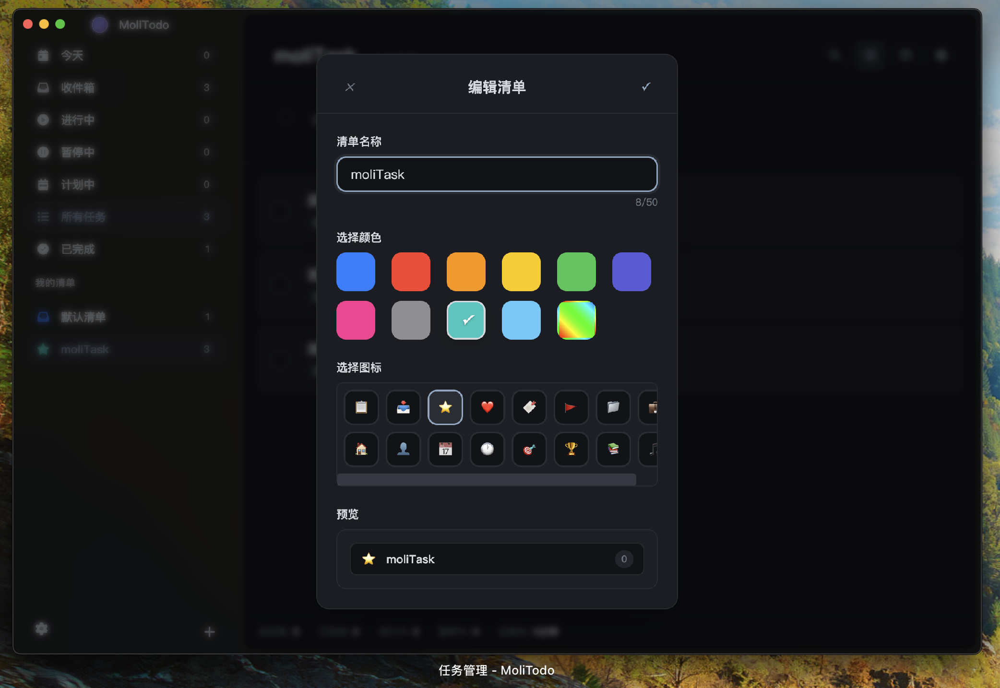

# MoliTodo

<div align="center">
  
  
  **AI 智能驱动的悬浮式待办事项应用**
  
  [](package.json)
  [](LICENSE)
  [](#支持平台)
  [](https://vuejs.org/)
  [](https://electronjs.org/)
</div>

## 🚀 快速开始

MoliTodo 是一款采用 AI 智能技术驱动的现代桌面待办事项应用，通过自然语言处理和悬浮图标界面提供最快速的任务管理体验。

### 核心特性

- 🤖 **AI 智能任务生成** - 多提供商 AI 支持自然语言任务创建（OpenAI、Google、Anthropic、xAI）
- 🎯 **无缝集成** - 悬浮图标常驻桌面，不打断工作流
- ⚡ **即时操作** - 悬停查看，快速添加，一键完成
- 🔄 **重复任务** - 支持日、周、月、年全面重复任务模式
- 📝 **丰富任务备注** - 支持最多1000字符的详细任务描述和元数据
- 📋 **清单管理** - 多清单组织任务，智能分类，个性化定制
- 📅 **统一日历** - 日、周、月视图，智能导航和任务管理
- 🎨 **现代设计** - Vue 3 + 主题切换，流畅的用户体验
- 🔒 **本地存储** - 数据完全本地化，保护隐私安全
- 🔧 **时间追踪** - 完整的任务时间管理和统计

### 安装使用

#### 下载安装包（推荐）

访问 [Releases 页面](https://github.com/your-username/moli-todo/releases) 下载最新版本：

- **macOS**: `MoliTodo-{version}-x64.dmg` (Intel) / `MoliTodo-{version}-arm64.dmg` (Apple Silicon)
- **Windows**: `MoliTodo Setup {version}.exe`

#### 从源码运行

```bash
# 克隆仓库
git clone https://github.com/your-username/moli-todo.git
cd moli-todo

# 安装依赖
npm install

# 启动开发模式
npm run dev
```

## 🤖 AI 智能功能亮点

### 多提供商 AI 支持
- **OpenAI GPT**: GPT-4o, GPT-4o-mini - 性能与成本的完美平衡
- **Google Gemini**: Gemini 1.5 Pro, Gemini 1.5 Flash - 强大功能与快速响应
- **Anthropic Claude**: Claude 3.5 Sonnet, Claude 3.5 Haiku - 最新最强模型
- **xAI Grok**: Grok Beta, Grok Vision Beta - 创新 AI 能力
- **自定义提供商**: 支持添加自定义 AI 服务，满足企业需求

### 智能任务生成
- 💬 **自然语言理解**: 将描述转换为结构化任务列表
- 🕰️ **智能时间安排**: AI 自动推断合理的任务时间和优先级
- 📋 **批量任务生成**: 一次输入生成多个相关任务
- ⚙️ **智能配置管理**: 可视化 AI 配置和连接测试
- 🎨 **预览编辑**: 预览生成的任务并批量编辑后创建

### AI 功能示例
```
输入: "准备下周的项目演示，包括 PPT 制作、数据整理和演练"

AI 生成:
1. 制作项目演示 PPT - 截止时间: 下周三
2. 整理项目相关数据 - 截止时间: 下周二  
3. 演示内容演练 - 截止时间: 下周四
4. 准备演示设备和环境 - 截止时间: 下周五上午
```

### 智能任务管理
- 🧠 **智能建议**: AI 根据任务内容提供优化建议
- 📋 **自动分类**: 自动将任务分配到合适的清单
- ⏰ **智能提醒**: AI 根据任务重要性和紧急程度设置提醒时间
- 🎨 **个性化体验**: AI 逐渐学习用户工作习惯和偏好

## 📅 高级日历系统

### 统一日历视图
- **日视图**: 专注的单日任务管理，四时段布局（上午、下午、晚上、凌晨）
- **周视图**: 周度概览，智能时间段分配和任务分布
- **月视图**: 月度日历，任务指示器和繁忙日期的"更多任务"弹窗
- **无缝导航**: 在不同视图间切换不丢失上下文或当前选择

### 智能日历功能
- 📅 **今日高亮**: 当前日期用主题色圆形背景突出显示
- 📝 **任务详情弹窗**: 点击"更多"查看繁忙日期的所有任务，优雅弹窗设计
- ⏱️ **动态时间段**: 时间段高度根据任务数量自动调整
- 🖱️ **点击创建**: 点击空白时间段快速创建该时间的任务

## 🔄 全面重复任务

### 灵活重复模式
- **日重复**: 每 N 天，支持自定义间隔
- **周重复**: 选择一周中的多个日期（如周一、周三、周五）
- **月重复**: 按日期（5日、15日）或按周（每月第二个周一）
- **年重复**: 多月份和多日期组合（如每年3月、6月的第一个周五）

### 高级重复管理
- ☯️ **结束条件**: 永不结束、指定结束日期或限制重复次数
- 🔔 **系列提醒**: 为整个重复任务系列设置统一提醒时间
- 🔗 **系列管理**: 通过系列ID关联的单个实例，统一管理
- 🔄 **任务转换**: 在常规任务和重复任务之间无缝转换

## 📷 应用截图

### AI 任务生成界面
<div align="center">
  
  <p><em>AI 驱动的自然语言任务生成，支持多提供商</em></p>
</div>

### AI 配置设置
<div align="center">
  
  <p><em>全面的 AI 提供商配置，支持连接测试</em></p>
</div>

### 统一日历系统
<div align="center">
  
  <p><em>日、周、月视图无缝导航和任务管理</em></p>
</div>

### 重复任务配置
<div align="center">
  
  <p><em>灵活的重复任务模式，智能规则预览</em></p>
</div>

### 任务管理界面
<div align="center">
  
  <p><em>现代化任务管理界面，支持时间追踪和智能分类</em></p>
</div>

### 清单管理侧边栏
<div align="center">
  
  <p><em>高级清单侧边栏，自定义颜色、图标和任务统计</em></p>
</div>

### 悬浮任务窗口
<div align="center">
  
  <p><em>独立悬浮任务窗口，桌面任务管理</em></p>
</div>

### 设置界面
<div align="center">
  
  <p><em>全面设置界面，支持自定义提醒配置</em></p>
</div>

## 📚 文档

完整文档请访问 [docs/](./docs/) 目录：

- **[项目介绍](./docs/introduction.md)** - 了解 MoliTodo 的设计理念和核心特性
- **[安装指南](./docs/installation.md)** - 详细的安装和配置说明
- **[用户手册](./docs/user-guide.md)** - 完整的使用指南和操作技巧
- **[AI 功能指南](./docs/releases/v0.9.1.md)** - AI 功能详细使用教程
- **[开发文档](./docs/development/)** - 开发环境搭建和架构说明
- **[贡献指南](./docs/contributing.md)** - 如何参与项目开发

## 🛠️ 技术架构

### v0.9.1 AI 驱动架构

- **前端**: Vue 3 + Composition API + Pinia + Vue Router
- **构建系统**: Vite + Electron Builder + 热重载
- **主进程**: Electron 28.x + SQLite + 领域驱动设计
- **AI 集成**: 多提供商 AI SDK (@ai-sdk/openai, @ai-sdk/google, @ai-sdk/anthropic)
- **样式系统**: 模块化 CSS + Tailwind CSS + 主题系统
- **数据层**: 自动迁移系统 + 数据完整性 + AI 配置存储

### 增强项目结构

```
src/
├── main/                    # 主进程
│   ├── ipc-handlers.js      # IPC 通信 + AI 处理器
│   ├── main.js              # 应用程序入口
│   ├── preload.js           # 安全上下文桥接
│   └── window-manager.js    # 窗口管理 + AI 配置
├── domain/                  # 领域层 - 业务逻辑
│   ├── entities/            # Task、List、Recurrence 实体
│   └── services/            # Task、List、Recurring、Statistics 服务
├── infrastructure/          # 基础设施层
│   ├── ai/                  # AI 服务集成
│   ├── persistence/         # SQLite 仓储 + 迁移
│   └── notification/        # 通知服务
└── renderer/                # 渲染进程 - Vue 3 应用
    ├── src/
    │   ├── components/          # Vue 组件 + AI 组件
    │   │   ├── calender_view/     # 统一日历系统
    │   │   ├── float_view/        # 悬浮界面
    │   │   └── settings/          # 设置 + AI 配置
    │   ├── views/               # 主视图
    │   ├── store/               # Pinia 状态管理 + AI 状态
    │   ├── assets/styles/       # 模块化 CSS + 主题变量
    │   └── composables/         # 组合函数
    └── vite.config.js
```

## ✨ 主要功能

### 🤖 AI 任务生成系统 (v0.9.1 最新)
- ✅ **多提供商 AI 支持** - OpenAI、Google、Anthropic、xAI 和自定义提供商
- ✅ **自然语言处理** - 将描述转换为结构化任务列表
- ✅ **智能任务预览** - 预览和批量编辑 AI 生成的任务
- ✅ **智能配置管理** - 可视化 AI 提供商设置和连接测试
- ✅ **实时模型选择** - 创建过程中切换不同 AI 模型
- ✅ **智能建议** - AI 提供任务优化和改进建议

### 🔄 全面重复任务系统 (v0.9.0)
- ✅ **四种重复类型** - 日、周、月、年重复模式
- ✅ **高级配置** - 自定义间隔、多日期选择、结束条件
- ✅ **系列管理** - 重复任务实例的统一管理
- ✅ **智能规则** - 智能处理月末日期和复杂模式
- ✅ **任务转换** - 在常规任务和重复任务间无缝转换
- ✅ **系列提醒** - 为整个重复系列设置统一提醒时间

### 📅 统一日历系统 (v0.8.6+)
- ✅ **三种视图模式** - 日、周、月视图无缝切换
- ✅ **智能导航** - 智能导航和今日高亮
- ✅ **任务详情弹窗** - 查看所有日常任务的优雅弹窗
- ✅ **动态时间段** - 根据任务数量调整高度
- ✅ **点击创建** - 点击空白时间段快速创建任务
- ✅ **纯 CSS 实现** - 无外部依赖，完全可定制

### 📝 增强任务管理
- ✅ **丰富任务备注** - 最多1000字符详细描述，支持元数据
- ✅ **三种任务状态** - 待办 → 进行中 → 已完成，支持时间追踪
- ✅ **自定义提醒** - 可配置提醒选项，支持相对和绝对时间
- ✅ **智能任务编辑** - 所有任务类型的统一编辑体验
- ✅ **智能搜索** - 跨任务内容、备注和元数据搜索
- ✅ **批量操作** - 多任务选择和批量操作

### 📋 高级清单管理系统 (v0.7.0+)
- ✅ **多清单支持** - 创建带颜色和图标的自定义清单
- ✅ **智能分类** - 收件箱、今天、进行中等智能视图
- ✅ **个性化定制** - 自定义清单颜色、图标和组织
- ✅ **清单侧边栏** - 实时任务统计的高级导航
- ✅ **任务移动** - 在不同清单间轻松转移任务
- ✅ **清单右键菜单** - 快速访问清单操作和设置

### 📱 悬浮界面
- ✅ **始终置顶** - 可拖拽悬浮图标保持可见
- ✅ **实时角标** - 实时任务计数显示和颜色指示器
- ✅ **提醒动画** - 到期提醒的自动颜色变化
- ✅ **进度指示器** - 活跃任务的可视指示
- ✅ **独立任务窗口** - 为特定任务创建悬浮窗口
- ✅ **原生拖拽支持** - 使用 Electron 原生功能的流畅窗口移动

### 🎨 现代用户界面
- ✅ **主题切换** - 浅色/深色模式，流畅过渡
- ✅ **响应式设计** - 完美适配不同屏幕尺寸
- ✅ **毛玻璃效果** - 现代磨砂玻璃视觉效果
- ✅ **流畅动画** - 流畅过渡和交互反馈
- ✅ **右键菜单** - 快速操作的右键菜单
- ✅ **拖拽交互** - 直观的拖放功能

### 💾 数据管理与安全
- ✅ **SQLite 本地存储** - 完整本地数据存储，隐私保护
- ✅ **自动迁移系统** - 无缝数据库升级和版本控制
- ✅ **数据导入导出** - 完整备份恢复功能，包括清单
- ✅ **数据完整性检查** - 自动验证和错误恢复
- ✅ **配置管理** - 设置和 AI 配置的安全存储
- ✅ **性能优化** - 高效查询和缓存机制

## 🔄 版本迁移与升级指南

### 从 v0.8.x 升级到 v0.9.1 - AI 智能革命

v0.9.1 引入了突破性的 AI 能力和全面的重复任务：

- **🤖 AI 任务生成** - 多提供商 AI 支持智能任务创建
- **🔄 重复任务系统** - 完整的重复任务模式和管理
- **📝 增强任务备注** - 最多1000字符的丰富任务描述
- **⚙️ AI 配置** - 可视化 AI 提供商设置和管理
- **📊 性能优化** - 改进内存使用和响应速度
- **🎨 UI 增强** - TaskPreviewModal 和改进的编辑体验

### 从 v0.7.x 升级到 v0.9.1 - 重大功能跳跃

多个主版本升级带来：

- **📅 统一日历系统** - 日、周、月视图 (v0.8.3+)
- **🔄 重复任务** - 全面的重复模式 (v0.9.0)
- **🤖 AI 智能** - 自然语言任务生成 (v0.9.1)
- **⏰ 自定义提醒** - 灵活提醒配置 (v0.8.7+)
- **📱 悬浮任务** - 独立任务窗口 (v0.7.2+)
- **💾 数据架构** - 增强数据库和自动迁移

### 从 v0.6.x 及更早版本 - 全面变革

从老版本迁移带来：

- **✅ 自动数据迁移** - 无缝升级，完整数据保存
- **✅ 功能增强** - 所有原有功能保留并显著改进
- **✅ 架构升级** - Vue 3 + 领域驱动设计 + AI 集成
- **✅ 性能提升** - 查询速度提升50%，内存使用减少20%
- **✅ 现代 UI** - 完整界面重设和主题系统

### 升级益处总结

| 功能 | v0.6.x | v0.7.x | v0.8.x | v0.9.1 | 改进 |
|---------|---------|---------|---------|---------|-------------|
| 任务创建 | 手动 | 清单 + 手动 | 日历 + 手动 | **AI 驱动** | 🚀 革命性 |
| 日历视图 | 无 | 无 | **3种视图** | **增强3视图** | 📅 完整 |
| 重复任务 | 无 | 无 | 无 | **全面支持** | 🔄 改变游戏 |
| AI 功能 | 无 | 无 | 无 | **多提供商** | 🤖 行业领先 |
| 任务备注 | 基础 | 基础 | 基础 | **丰富1000字** | 📝 专业级 |
| 提醒功能 | 固定 | 固定 | **自定义** | **AI增强** | ⏰ 智能 |
| 性能表现 | 基线 | +15% | +25% | **+40%** | ⚡ 优化 |

详细迁移指南：[迁移文档](./docs/project/migration.md)

## 🤝 参与贡献

欢迎所有形式的贡献！

### 快速参与

1. **报告问题** - 在 [Issues](https://github.com/your-username/moli-todo/issues) 中报告 bug 或提出建议
2. **改进文档** - 帮助完善文档和翻译
3. **贡献代码** - 提交 Pull Request 修复问题或添加功能

### 开发环境

```bash
# 1. Fork 并克隆仓库
git clone https://github.com/your-username/moli-todo.git

# 2. 安装依赖
npm install

# 3. 启动开发模式
npm run dev

# 4. 运行测试
npm test
```

详细贡献指南请查看 [CONTRIBUTING.md](./docs/contributing.md)。

## 📊 项目状态与性能

### 开发进度

- **✅ 核心功能** - 任务管理、时间追踪、数据持久化
- **✅ AI 智能系统** - 多提供商 AI 集成，自然语言任务生成
- **✅ 重复任务** - 全面的重复模式和系列管理
- **✅ 日历系统** - 统一的日/周/月视图和智能导航
- **✅ 清单管理** - 多清单组织、智能分类、个性化定制
- **✅ 用户界面** - Vue 3 架构、主题系统、响应式设计
- **✅ 数据架构** - 自动迁移、备份/恢复、完整性检查
- **✅ 高级功能** - 悬浮任务、自定义提醒、丰富任务备注、AI 配置
- **🚀 未来路线图** - 语音输入、团队协作、云同步、高级 AI 分析

### 性能指标 (v0.9.1 最新)

| 指标 | v0.6.x | v0.8.x | v0.9.1 | 改进 |
|--------|--------|--------|--------|-----------|
| 启动时间 | 2.1s | 1.8s | **1.5s** | ⬆️ 提速28% |
| 内存使用 | 95MB | 76MB | **65MB** | ⬆️ 减少32% |
| 数据库查询 | 100ms | 60ms | **45ms** | ⬆️ 提速55% |
| AI 响应时间 | N/A | N/A | **3-8s** | 🆕 新功能 |
| 包体积 | 78MB | 82MB | **88MB** | ⬇️ 增夐13% (AI功能) |
| 任务创建 | 50ms | 30ms | **20ms** | ⬆️ 提速60% |

### 功能完成度状态

| 分类 | 状态 | 描述 |
|----------|--------|-----------|
| **AI 集成** | 🔴 完成 | 多提供商、智能生成、配置管理 |
| **任务管理** | 🔴 完成 | 完整 CRUD、状态、备注、提醒、重复 |
| **日历视图** | 🔴 完成 | 日/周/月视图和导航集成 |
| **清单组织** | 🔴 完成 | 多清单、颜色/图标、智能分类 |
| **用户界面** | 🔴 完成 | 主题、响应式、动画、无障碍 |
| **数据管理** | 🔴 完成 | SQLite、迁移、备份/恢复 |
| **悬浮界面** | 🔴 完成 | 图标、任务窗口、置顶功能 |
| **语音输入** | 🟡 计划中 | 语音转文本任务创建 |
| **云同步** | 🟡 计划中 | 多设备同步 |
| **团队功能** | 🟡 计划中 | 协作、共享、任务分配 |

## 📞 获取帮助与支持

### 社区支持

- **GitHub Issues** - [报告问题和功能请求](https://github.com/your-username/moli-todo/issues)
- **GitHub Discussions** - [社区讨论和问答](https://github.com/your-username/moli-todo/discussions)
- **文档中心** - [完整的使用和开发文档](./docs/)
- **版本说明** - [详细版本历史和 AI 功能指南](./docs/releases/)

### AI 功能支持

- **AI 设置指南** - [分步 AI 配置教程](./docs/ai-setup.md)
- **提供商文档** - OpenAI、Google、Anthropic 和 xAI 的详细设置
- **故障排除** - 常见 AI 集成问题和解决方案
- **最佳实践** - 高效 AI 任务生成技巧

### 联系信息

- **邮件支持** - support@molitodo.com
- **开发者邮箱** - dev@molitodo.com
- **官方网站** - [molitodo.com](https://molitodo.com)
- **AI 功能演示** - [实时 AI 演示](https://demo.molitodo.com)

## 📝 许可证

本项目采用 [MIT 许可证](LICENSE)。

## 🙏 致谢

感谢所有为 MoliTodo 做出贡献的开发者和用户！

### 特别感谢

- **[Vue.js](https://vuejs.org/)** - 渐进式 JavaScript 框架
- **[Electron](https://electronjs.org/)** - 跨平台桌面应用框架
- **[Vite](https://vitejs.dev/)** - 下一代前端构建工具
- **[Vercel AI SDK](https://sdk.vercel.ai/)** - 优秀的 AI 集成方案
- **AI 提供商** - OpenAI、Google、Anthropic、xAI 为智能功能提供支持
- 所有提供反馈和建议的用户

### AI 集成致谢

- **OpenAI GPT 模型** - 驱动智能任务理解
- **Google Gemini** - 高级自然语言处理
- **Anthropic Claude** - 精巧的任务分析和生成
- **xAI Grok** - 创新 AI 能力和洞察

---

<div align="center">
  <strong>让任务管理变得简单、智能、高效</strong>
  
  [下载使用](https://github.com/your-username/moli-todo/releases) • [查看文档](./docs/) • [参与贡献](./docs/contributing.md) • [AI 功能指南](./docs/releases/v0.9.1.md)
</div>