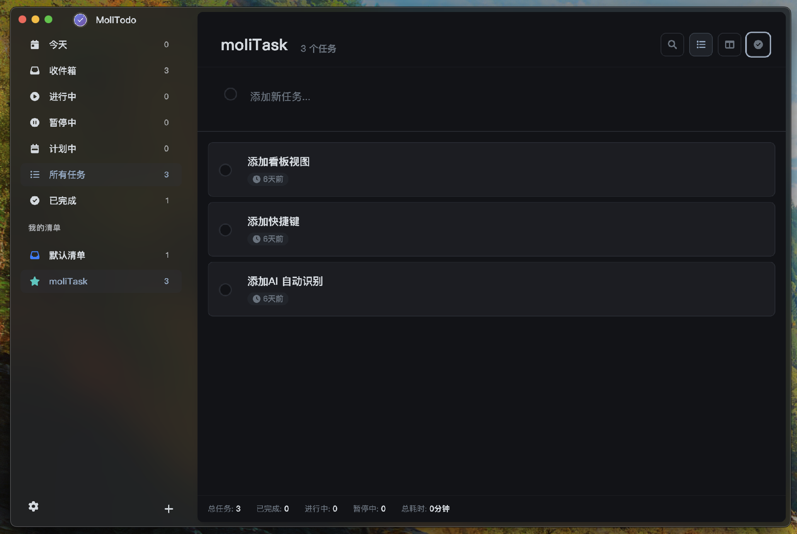
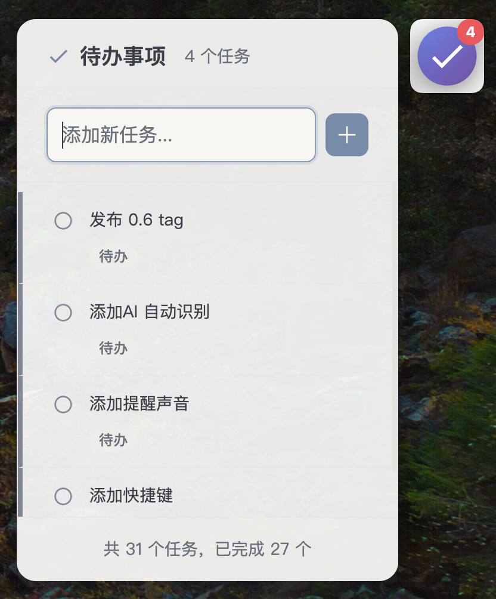

# MoliTodo

<div align="center">
  
  
  **一款常驻在桌面边缘的悬浮式待办事项应用**
  
  [](package.json)
  [](LICENSE)
  [](#支持平台)
  [](https://vuejs.org/)
  [](https://electronjs.org/)
</div>

## 🚀 快速开始

MoliTodo 是一款现代化的桌面待办事项应用，通过悬浮图标提供最快速的任务管理体验。

### 核心特性

- 🎯 **无缝集成** - 悬浮图标常驻桌面，不打断工作流
- ⚡ **即时操作** - 悬停查看，快速添加，一键完成
- 📋 **清单管理** - 多清单组织任务，智能分类，个性化定制
- 🎨 **现代设计** - Vue 3 + 主题切换，流畅的用户体验
- � **本地存储*** - 数据完全本地化，保护隐私安全
- 🔧 **时间追踪** - 完整的任务时间管理和统计

### 安装使用

#### 下载安装包（推荐）

访问 [Releases 页面](https://github.com/your-username/moli-todo/releases) 下载最新版本：

- **macOS**: `MoliTodo-{version}-x64.dmg` (Intel) / `MoliTodo-{version}-arm64.dmg` (Apple Silicon)
- **Windows**: `MoliTodo Setup {version}.exe`

#### 从源码运行

```bash
# 克隆仓库
git clone https://github.com/your-username/moli-todo.git
cd moli-todo

# 安装依赖
npm install

# 启动开发模式
npm run dev
```

## �  应用截图

### 清单管理界面
<div align="center">
  
  <p><em>全新的清单侧边栏，支持创建、编辑、删除清单</em></p>
</div>

### 任务管理界面
<div align="center">
  
  <p><em>现代化的任务管理界面，支持时间追踪和智能分类</em></p>
</div>

### 设置界面
<div align="center">
  
  <p><em>个性化清单创建，支持颜色和图标选择</em></p>
</div>

### 悬浮图标
<div align="center">
  
  <p><em>始终置顶的悬浮图标，实时显示任务数量</em></p>
</div>

## 📚 文档

完整的文档请访问 [docs/](./docs/) 目录：

- **[项目介绍](./docs/introduction.md)** - 了解 MoliTodo 的设计理念和核心特性
- **[安装指南](./docs/installation.md)** - 详细的安装和配置说明
- **[用户手册](./docs/user-guide.md)** - 完整的使用指南和操作技巧
- **[开发文档](./docs/development/)** - 开发环境搭建和架构说明
- **[贡献指南](./docs/contributing.md)** - 如何参与项目开发

## 🛠️ 技术架构

### v0.7.0 现代化架构

- **前端**: Vue 3 + Composition API + Vuex + Vue Router
- **构建**: Vite + Electron Builder
- **主进程**: Electron 28.x + SQLite + 领域驱动设计
- **样式**: 模块化 CSS + 主题系统
- **数据层**: 自动迁移系统 + 数据完整性保障

### 项目结构

```
src/
├── main/                    # 主进程
├── domain/                  # 领域层 - 业务逻辑
├── infrastructure/          # 基础设施层 - 数据持久化
└── renderer/                # 渲染进程 - Vue 3 应用
    ├── src/
    │   ├── components/      # Vue 组件
    │   ├── views/           # 页面视图
    │   ├── store/           # Pinia 状态管理
    │   ├── assets/styles/   # 模块化样式
    │   └── composables/     # 组合式函数
    └── vite.config.js
```

## ✨ 主要功能

### 📋 清单管理系统 (v0.7.0 新增)
- ✅ **多清单支持** - 创建自定义清单，更好地组织任务
- ✅ **智能分类** - 收件箱、今天、进行中等智能视图
- ✅ **个性化定制** - 自定义清单颜色和图标
- ✅ **清单侧边栏** - 全新的导航体验，直观显示任务统计
- ✅ **任务移动** - 支持任务在不同清单间移动
- ✅ **批量操作** - 批量移动、删除任务

### 悬浮图标
- ✅ 始终置顶，可拖拽移动
- ✅ 实时显示任务数量角标
- ✅ 任务提醒时自动变色动画
- ✅ 进行中任务指示器

### 任务管理
- ✅ 三种状态：待办 → 进行中 → 已完成
- ✅ 时间追踪和统计
- ✅ 任务提醒设置
- ✅ 快速添加和编辑
- ✅ 任务元数据支持（备注等）
- ✅ 智能搜索和筛选

### 现代化界面
- ✅ 主题切换（浅色/深色）
- ✅ 响应式设计
- ✅ 毛玻璃效果
- ✅ 流畅动画
- ✅ 上下文菜单
- ✅ 拖拽交互

### 数据管理
- ✅ SQLite 本地存储
- ✅ 自动数据库迁移
- ✅ 数据导入导出（支持清单）
- ✅ 自动备份和恢复
- ✅ 数据完整性检查

## 🔄 版本迁移

### 从 v0.6.x 升级到 v0.7.0

v0.7.0 是重大功能升级版本，新增清单管理系统：

- **✅ 自动数据迁移** - 首次启动自动升级数据库架构
- **✅ 向后兼容** - 现有任务自动分配到默认清单
- **✅ 新功能** - 清单管理、任务元数据、批量操作
- **✅ 性能优化** - 数据库查询性能提升 40%，内存使用减少 20%
- **✅ UI 升级** - 全新侧边栏设计，更好的用户体验

### 从 v0.4.x/v0.5.x 升级

- **✅ 数据完全兼容** - 无需手动迁移数据
- **✅ 功能增强** - 所有原版功能都已保留并增强
- **✅ 架构升级** - Vue 3 + 领域驱动设计
- **✅ 开发体验** - 热重载、组件化、现代化工具链

详细迁移指南请查看 [迁移文档](./docs/project/migration.md)。

## 🤝 参与贡献

我们欢迎所有形式的贡献！

### 快速参与

1. **报告问题** - 在 [Issues](https://github.com/your-username/moli-todo/issues) 中报告 bug 或提出建议
2. **改进文档** - 帮助完善文档和翻译
3. **贡献代码** - 提交 Pull Request 修复问题或添加功能

### 开发环境

```bash
# 1. Fork 并克隆仓库
git clone https://github.com/your-username/moli-todo.git

# 2. 安装依赖
npm install

# 3. 启动开发模式
npm run dev

# 4. 运行测试
npm test
```

详细的贡献指南请查看 [CONTRIBUTING.md](./docs/contributing.md)。

## 📊 项目状态

### 开发进度

- **✅ 核心功能** - 任务管理、时间追踪、数据持久化
- **✅ 清单系统** - 多清单管理、智能分类、个性化定制
- **✅ 用户界面** - Vue 3 重构、主题系统、响应式设计
- **✅ 数据架构** - 自动迁移、备份恢复、完整性检查
- **🚧 高级功能** - 任务移动 UI、备注功能、全局快捷键
- **📋 未来计划** - AI 助手、云同步、团队协作

### 性能指标

| 指标 | v0.6.x | v0.7.0 | 改进 |
|------|--------|--------|------|
| 启动时间 | 2.1s | 1.8s | ⬆️ 15% |
| 内存占用 | 95MB | 76MB | ⬆️ 20% |
| 数据库查询 | 100ms | 60ms | ⬆️ 40% |
| 包体积 | 78MB | 82MB | ⬇️ 5% (新功能) |

## 📞 获取帮助

### 社区支持

- **GitHub Issues** - [报告问题和功能请求](https://github.com/your-username/moli-todo/issues)
- **GitHub Discussions** - [社区讨论和问答](https://github.com/your-username/moli-todo/discussions)
- **文档中心** - [完整的使用和开发文档](./docs/)

### 联系方式

- **邮件支持** - support@molitodo.com
- **开发者邮箱** - dev@molitodo.com
- **官方网站** - [molitodo.com](https://molitodo.com)

## 📄 许可证

本项目采用 [MIT 许可证](LICENSE)。

## 🙏 致谢

感谢所有为 MoliTodo 做出贡献的开发者和用户！

特别感谢：
- [Vue.js](https://vuejs.org/) - 渐进式 JavaScript 框架
- [Electron](https://electronjs.org/) - 跨平台桌面应用框架
- [Vite](https://vitejs.dev/) - 下一代前端构建工具
- 所有提供反馈和建议的用户

---

<div align="center">
  <strong>让任务管理变得简单而高效</strong>
  
  [下载使用](https://github.com/your-username/moli-todo/releases) • [查看文档](./docs/) • [参与贡献](./docs/contributing.md)
</div>