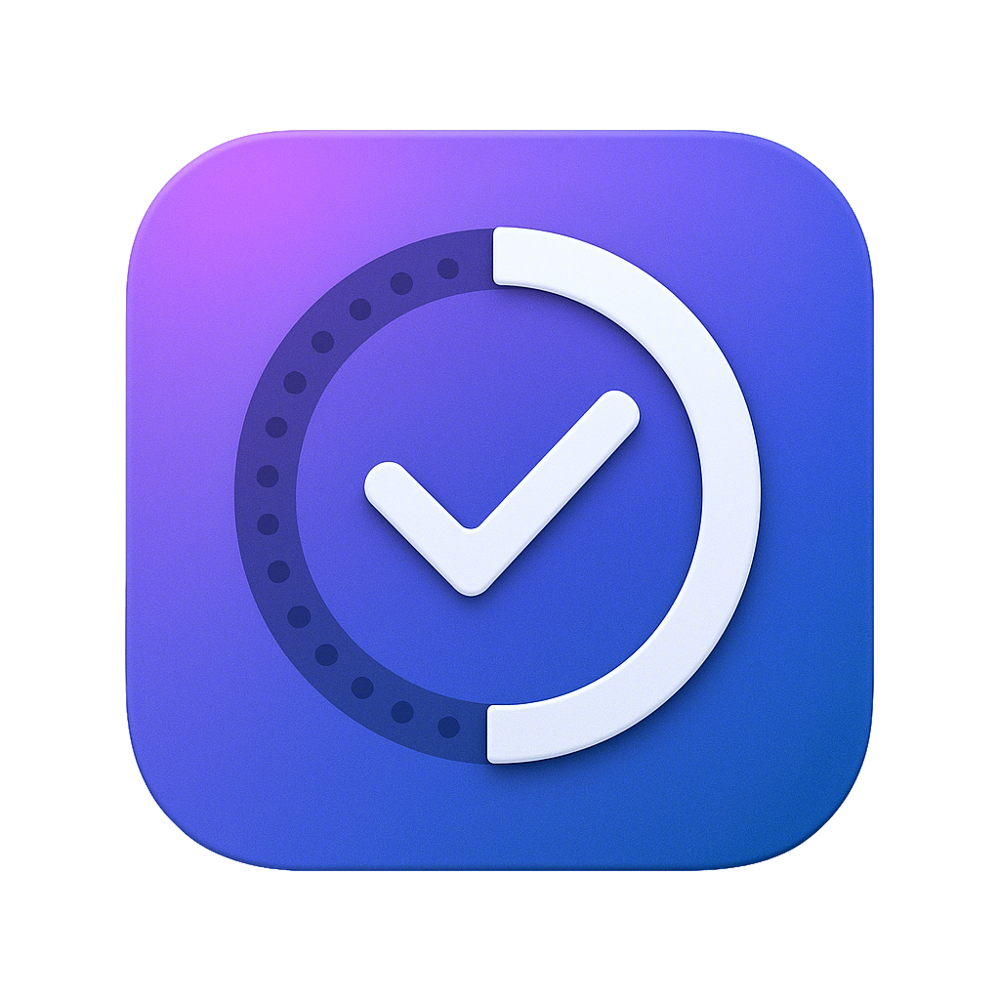
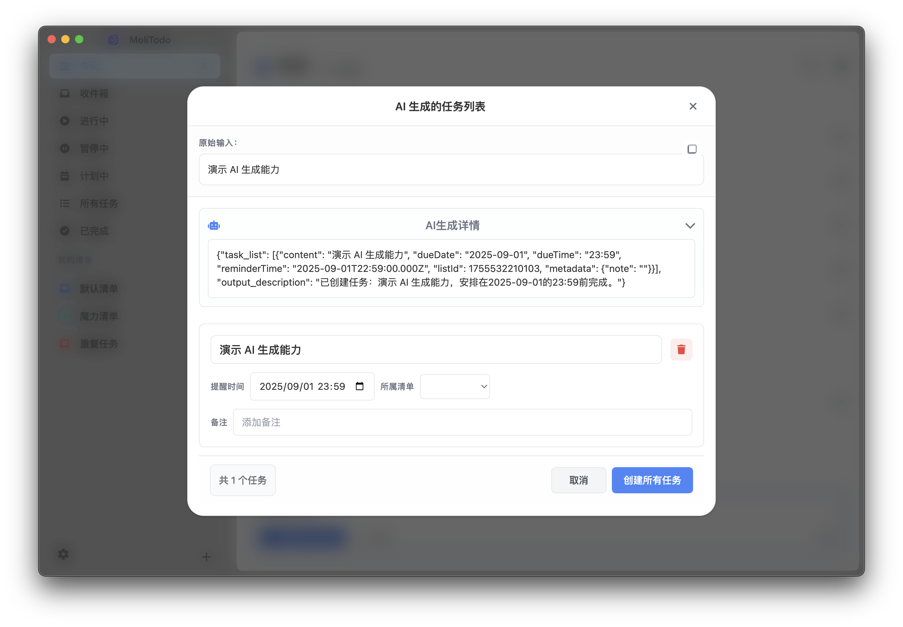
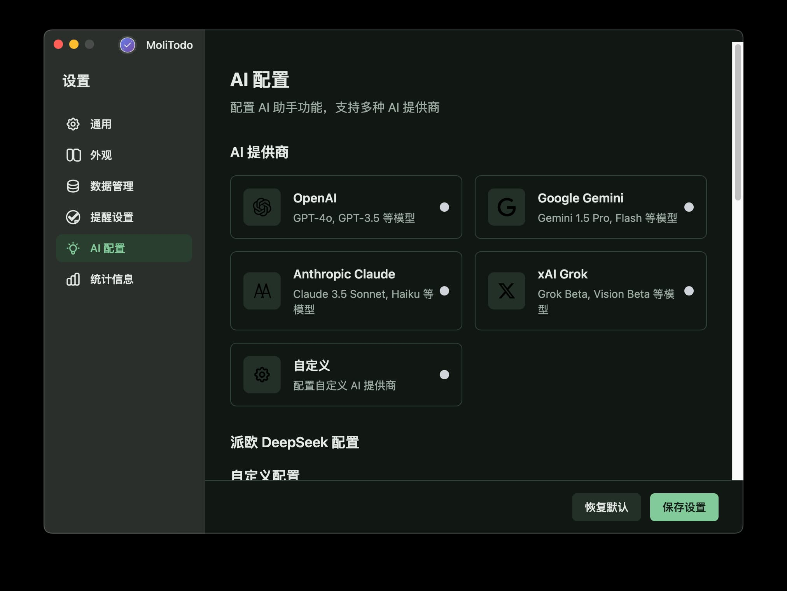
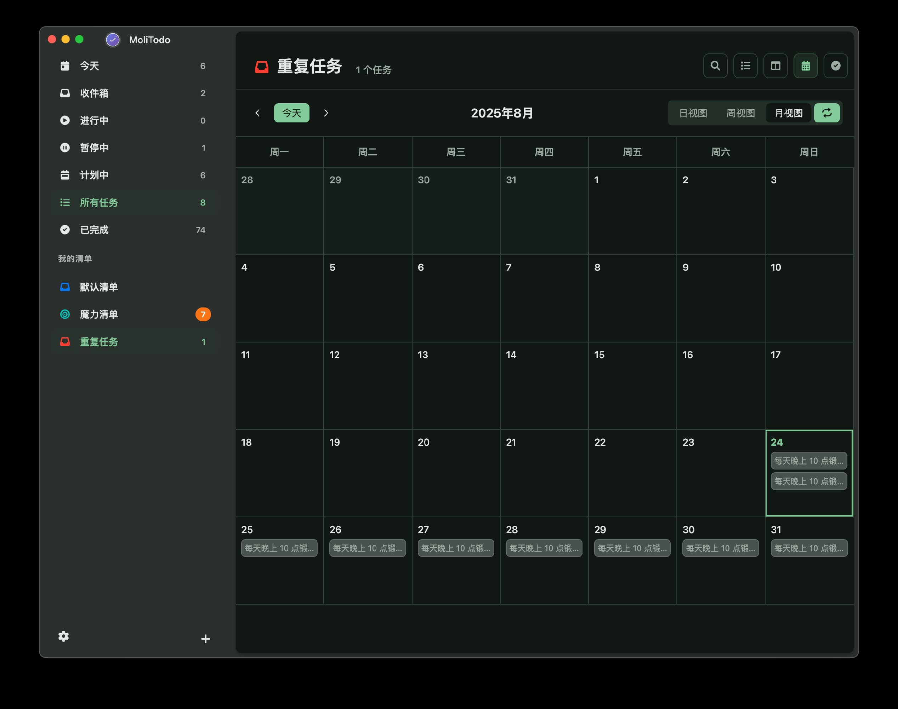
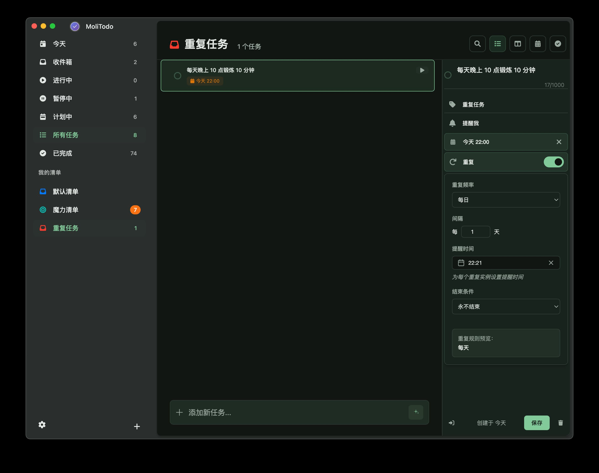
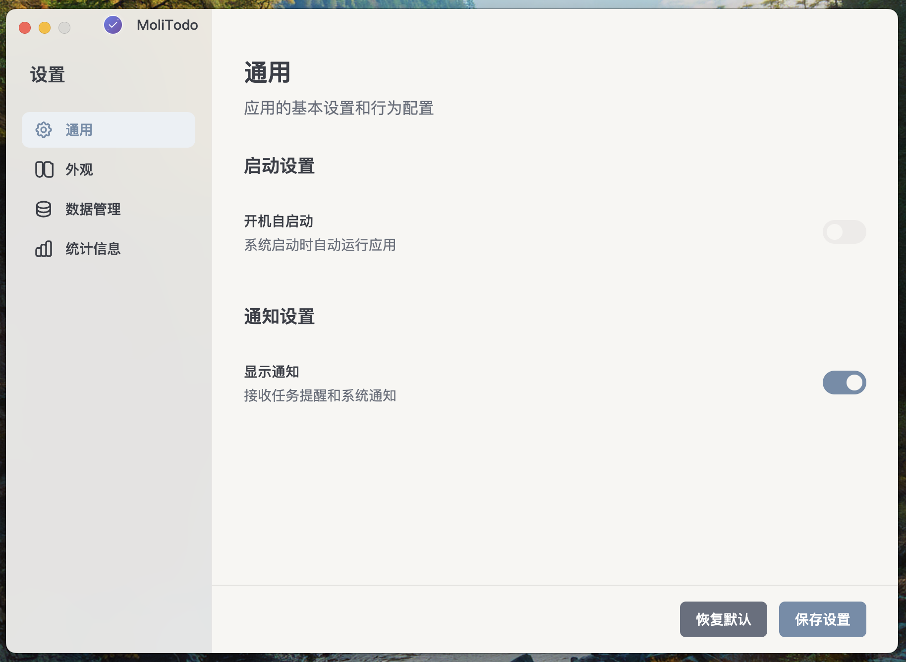

# MoliTodo

<div align="center">
  
  
  **AI 智能驱动的悬浮式待办事项应用**
  
  [](package.json)
  [](LICENSE)
  [](#支持平台)
  [](https://vuejs.org/)
  [](https://electronjs.org/)
</div>

## 🚀 快速开始

MoliTodo is a modern AI-powered desktop task management application that provides the fastest task management experience through intelligent natural language processing and a floating icon interface.

### Core Features

- 🤖 **AI Task Generation** - Natural language task creation with multi-provider AI support (OpenAI, Google, Anthropic, xAI)
- 📊 **AI Report Generation** - Intelligent daily and weekly report generation with customizable templates  
- 🎯 **Seamless Integration** - Floating icon stays on desktop without interrupting workflow
- ⚡ **Instant Operations** - Hover to view, quick add, one-click complete
- 🔄 **Recurring Tasks** - Comprehensive recurring task system supporting daily, weekly, monthly, yearly patterns
- 📝 **Rich Task Notes** - Detailed task descriptions and metadata support up to 1000 characters
- 📋 **List Management** - Multi-list organization, smart categorization, personalized customization
- 📅 **Unified Calendar** - Day, week, month views with intelligent navigation and task management
- 🎨 **Modern Design** - Vue 3 + theme switching, smooth user experience
- 🔒 **Local Storage** - Completely local data, privacy protection
- 🔧 **Time Tracking** - Complete task time management and statistics

### 安装使用

#### 下载安装包（推荐）

访问 [Releases 页面](https://github.com/your-username/moli-todo/releases) 下载最新版本：

- **macOS**: `MoliTodo-{version}-x64.dmg` (Intel) / `MoliTodo-{version}-arm64.dmg` (Apple Silicon)
- **Windows**: `MoliTodo Setup {version}.exe`

#### 从源码运行

```
# 克隆仓库
git clone https://github.com/your-username/moli-todo.git
cd moli-todo

# 安装依赖
npm install

# 启动开发模式
npm run dev
```

## 🤖 AI Intelligent Features Highlights

### Multi-Provider AI Support
- **OpenAI GPT**: GPT-4o, GPT-4o-mini - Balanced performance and cost-effectiveness
- **Google Gemini**: Gemini 1.5 Pro, Gemini 1.5 Flash - Powerful capabilities and fast response
- **Anthropic Claude**: Claude 3.5 Sonnet, Claude 3.5 Haiku - Latest and strongest models
- **xAI Grok**: Grok Beta, Grok Vision Beta - Innovative AI capabilities
- **Custom Providers**: Support for adding custom AI services to meet enterprise needs

### Intelligent Task Generation
- 💬 **Natural Language Understanding**: Convert descriptions into structured task lists
- 🕰️ **Smart Time Scheduling**: AI automatically infers reasonable task timing and priorities
- 📋 **Batch Task Generation**: Generate multiple related tasks from a single input
- ⚙️ **Intelligent Configuration Management**: Visual AI configuration and connection testing
- 🎨 **Preview and Edit**: Preview generated tasks and batch edit before creation

### AI Feature Examples
```
Input: "Prepare for next week's project presentation, including PPT creation, data organization, and rehearsal"

AI Generated:
1. Create project presentation PPT - Due: Next Wednesday
2. Organize project-related data - Due: Next Tuesday  
3. Presentation content rehearsal - Due: Next Thursday
4. Prepare presentation equipment and environment - Due: Next Friday morning
```

### Smart Task Management
- 🧠 **Intelligent Suggestions**: AI provides optimization suggestions based on task content
- 📋 **Auto-categorization**: Automatically assign tasks to appropriate lists
- ⏰ **Smart Reminders**: AI sets reminder times based on task importance and urgency
- 🎨 **Personalized Experience**: AI gradually learns user work habits and preferences

## 📅 Advanced Calendar System

### Unified Calendar Views
- **Day View**: Focused single-day task management with four time periods (Morning, Afternoon, Evening, Late Night)
- **Week View**: Weekly overview with smart time slot allocation and task distribution
- **Month View**: Monthly calendar with task indicators and "more tasks" modal for busy days
- **Seamless Navigation**: Switch between views without losing context or current selection

### Smart Calendar Features
- 📅 **Today Highlighting**: Current date highlighted with theme color circular background
- 📝 **Task Details Modal**: Click "more" to see all tasks for busy days in an elegant popup
- ⏱️ **Dynamic Time Slots**: Time period height adjusts based on task quantity
- 💱 **Click to Create**: Click empty time slots to quickly create tasks for that time

## 🔄 Comprehensive Recurring Tasks

### Flexible Recurrence Patterns
- **Daily**: Every N days with custom intervals
- **Weekly**: Select multiple days of the week (e.g., Monday, Wednesday, Friday)
- **Monthly**: By date (5th, 15th) or by week (second Monday of each month)
- **Yearly**: Multi-month and multi-date combinations (e.g., first Friday of March and June)

### Advanced Recurrence Management
- ♾️ **End Conditions**: Never end, specific end date, or limited number of occurrences
- 🔔 **Series Reminders**: Set unified reminder time for entire recurring task series
- 🔗 **Series Management**: Individual instances linked by series ID for unified management
- 🔄 **Task Conversion**: Convert between regular and recurring tasks seamlessly

## 📷  Application Screenshots

### AI Task Generation Interface
<div align="center">
  
  <p><em>AI-powered natural language task generation with multi-provider support</em></p>
</div>

### AI Configuration Settings
<div align="center">
  
  <p><em>Comprehensive AI provider configuration with connection testing</em></p>
</div>

### Unified Calendar System
<div align="center">
  
  <p><em>Day, week, and month views with seamless navigation and task management</em></p>
</div>

### Recurring Tasks Configuration
<div align="center">
  
  <p><em>Flexible recurring task patterns with intelligent rule preview</em></p>
</div>

### Task Management Interface
<div align="center">
  
  <p><em>Modern task management interface with time tracking and smart categorization</em></p>
</div>

### List Management Sidebar
<div align="center">
  
  <p><em>Advanced list sidebar with custom colors, icons, and task statistics</em></p>
</div>

### Floating Task Window
<div align="center">
  
  <p><em>Independent floating task windows for desktop task management</em></p>
</div>

### Settings Interface
<div align="center">
  
  <p><em>Comprehensive settings with custom reminder configuration</em></p>
</div>

## 📚 文档

完整的文档请访问 [docs/](./docs/) 目录：

- **[项目介绍](./docs/introduction.md)** - 了解 MoliTodo 的设计理念和核心特性
- **[安装指南](./docs/installation.md)** - 详细的安装和配置说明
- **[用户手册](./docs/user-guide.md)** - 完整的使用指南和操作技巧
- **[开发文档](./docs/development/)** - 开发环境搭建和架构说明
- **[贡献指南](./docs/contributing.md)** - 如何参与项目开发

## 🛠️ Technology Architecture

### v1.0.0 AI-Powered Architecture with Report Generation

- **Frontend**: Vue 3 + Composition API + Pinia + Vue Router
- **Build System**: Vite + Electron Builder + Hot Reload
- **Main Process**: Electron 28.x + SQLite + Domain-Driven Design
- **AI Integration**: Multi-provider AI SDK (@ai-sdk/openai, @ai-sdk/google, @ai-sdk/anthropic)
- **AI Features**: Task Generation + Report Generation + Custom Templates
- **Styling**: Modular CSS + Tailwind CSS + Theme System
- **Data Layer**: Auto-migration System + Data Integrity + AI Configuration Storage

### Enhanced Project Structure

```
src/
├── main/                    # Main Process
│   ├── ipc-handlers.js      # IPC communication + AI handlers
│   ├── main.js              # Application entry
│   ├── preload.js           # Secure context bridge
│   └── window-manager.js    # Window management + AI config
├── domain/                  # Domain Layer - Business Logic
│   ├── entities/            # Task, List, Recurrence entities
│   └── services/            # Task, List, Recurring, Statistics services
├── infrastructure/          # Infrastructure Layer
│   ├── ai/                  # AI service integration + Report Generation
│   ├── persistence/         # SQLite repositories + migrations
│   └── notification/        # Notification service
└── renderer/                # Renderer Process - Vue 3 Application
    ├── src/
    │   ├── components/          # Vue components + AI components
    │   │   ├── calender_view/     # Unified calendar system
    │   │   ├── float_view/        # Floating interface
    │   │   └── settings/          # Settings + AI configuration
    │   ├── views/               # Main views
    │   ├── store/               # Pinia state management + AI state
    │   ├── assets/styles/       # Modular CSS + theme variables
    │   └── composables/         # Composition functions
    └── vite.config.js
```

## ✨ Main Features

### 🤖 AI Task Generation System (v0.9.1+)
- ✅ **Multi-Provider AI Support** - OpenAI, Google, Anthropic, xAI, and custom providers
- ✅ **Natural Language Processing** - Convert descriptions into structured task lists
- ✅ **Intelligent Task Preview** - Preview and batch edit AI-generated tasks
- ✅ **Smart Configuration Management** - Visual AI provider setup with connection testing
- ✅ **Real-time Model Selection** - Switch between different AI models during creation
- ✅ **Intelligent Suggestions** - AI provides task optimization and improvement suggestions

### 📊 AI Report Generation System (v1.0.0+)
- ✅ **One-Click Report Generation** - Generate daily and weekly reports instantly
- ✅ **Multi-Provider AI Support** - Leverage existing AI infrastructure for report generation
- ✅ **Custom Report Templates** - Configurable daily and weekly report templates
- ✅ **Smart Content Analysis** - AI analyzes task status, time distribution, and completion patterns
- ✅ **Time Filter Integration** - Seamlessly integrated into time filter component
- ✅ **Markdown Output** - Structured Markdown format for easy sharing and archival
- ✅ **Copy to Clipboard** - One-click copy functionality for immediate use

### 🔄 Comprehensive Recurring Tasks System (v0.9.0)
- ✅ **Four Recurrence Types** - Daily, weekly, monthly, yearly patterns
- ✅ **Advanced Configuration** - Custom intervals, multiple day selection, end conditions
- ✅ **Series Management** - Unified management of recurring task instances
- ✅ **Intelligent Rules** - Smart handling of month-end dates and complex patterns
- ✅ **Task Conversion** - Convert between regular and recurring tasks seamlessly
- ✅ **Series Reminders** - Set unified reminder times for entire recurring series

### 📅 Unified Calendar System (v0.8.6+)
- ✅ **Three View Modes** - Day, week, month views with seamless switching
- ✅ **Smart Navigation** - Intelligent navigation with today highlighting
- ✅ **Task Details Modal** - Elegant popup for viewing all daily tasks
- ✅ **Dynamic Time Slots** - Height adjustment based on task quantity
- ✅ **Click to Create** - Quick task creation by clicking empty time slots
- ✅ **Pure CSS Implementation** - No external dependencies, fully customizable

### 📝 Enhanced Task Management
- ✅ **Rich Task Notes** - Up to 1000 character detailed descriptions with metadata support
- ✅ **Three Task States** - Todo → In Progress → Completed with time tracking
- ✅ **Custom Reminders** - Configurable reminder options with relative and absolute times
- ✅ **Smart Task Editing** - Unified editing experience for all task types
- ✅ **Intelligent Search** - Search across task content, notes, and metadata
- ✅ **Batch Operations** - Multiple task selection and bulk operations

### 📋 Advanced List Management System (v0.7.0+)
- ✅ **Multi-List Support** - Create custom lists with colors and icons
- ✅ **Smart Categories** - Inbox, Today, In Progress, and other intelligent views
- ✅ **Personalization** - Custom list colors, icons, and organization
- ✅ **List Sidebar** - Advanced navigation with real-time task statistics
- ✅ **Task Movement** - Easy task transfer between different lists
- ✅ **List Context Menus** - Quick access to list operations and settings

### 📱 Floating Interface
- ✅ **Always on Top** - Draggable floating icon stays visible
- ✅ **Real-time Badge** - Live task count display with color indicators
- ✅ **Reminder Animations** - Automatic color changes for due reminders
- ✅ **Progress Indicator** - Visual indication of active tasks
- ✅ **Independent Task Windows** - Create floating windows for specific tasks
- ✅ **Native Drag Support** - Smooth window movement with Electron native features

### 🎨 Modern User Interface
- ✅ **Theme Switching** - Light/dark mode with smooth transitions
- ✅ **Responsive Design** - Perfect adaptation to different screen sizes
- ✅ **Glassmorphism Effects** - Modern frosted glass visual effects
- ✅ **Smooth Animations** - Fluid transitions and interactive feedback
- ✅ **Context Menus** - Right-click menus for quick operations
- ✅ **Drag Interactions** - Intuitive drag-and-drop functionality

### 💾 Data Management & Security
- ✅ **SQLite Local Storage** - Complete local data storage with privacy protection
- ✅ **Automatic Migration System** - Seamless database upgrades and version control
- ✅ **Data Import/Export** - Full backup and restore functionality including lists
- ✅ **Data Integrity Checks** - Automatic validation and error recovery
- ✅ **Configuration Management** - Secure storage of settings and AI configurations
- ✅ **Performance Optimization** - Efficient queries and caching mechanisms

## 🔄 Version Migration & Upgrade Guide

### From v0.8.x to v0.9.1 - AI Intelligence Revolution

v0.9.1 introduces groundbreaking AI capabilities and comprehensive recurring tasks:

- **🤖 AI Task Generation** - Multi-provider AI support for intelligent task creation
- **🔄 Recurring Tasks System** - Complete recurring task patterns and management
- **📝 Enhanced Task Notes** - Rich task descriptions up to 1000 characters
- **⚙️ AI Configuration** - Visual AI provider setup and management
- **📊 Performance Optimization** - Improved memory usage and response times
- **🎨 UI Enhancements** - TaskPreviewModal and improved editing experience

### From v0.7.x to v0.9.1 - Major Feature Leap

Multiple major version upgrades bringing:

- **📅 Unified Calendar System** - Day, week, month views (v0.8.3+)
- **🔄 Recurring Tasks** - Comprehensive recurrence patterns (v0.9.0)
- **🤖 AI Intelligence** - Natural language task generation (v0.9.1)
- **⏰ Custom Reminders** - Flexible reminder configuration (v0.8.7+)
- **📱 Floating Tasks** - Independent task windows (v0.7.2+)
- **💾 Data Architecture** - Enhanced database with auto-migration

### From v0.6.x and Earlier - Complete Transformation

Migrating from older versions brings:

- **✅ Automatic Data Migration** - Seamless upgrade with full data preservation
- **✅ Feature Enhancement** - All original features retained and significantly improved
- **✅ Architecture Upgrade** - Vue 3 + Domain-Driven Design + AI Integration
- **✅ Performance Gains** - 40% faster queries, 20% less memory usage
- **✅ Modern UI** - Complete interface redesign with theme system

### Upgrade Benefits Summary

| Feature | v0.6.x | v0.7.x | v0.8.x | v0.9.1 | Improvement |
|---------|---------|---------|---------|---------|-------------|
| Task Creation | Manual | Lists + Manual | Calendar + Manual | **AI-Powered** | 🚀 Revolutionary |
| Calendar Views | None | None | **3 Views** | **Enhanced 3 Views** | 📅 Complete |
| Recurring Tasks | None | None | None | **Full Support** | 🔄 Game-changer |
| AI Features | None | None | None | **Multi-Provider** | 🤖 Industry-leading |
| Task Notes | Basic | Basic | Basic | **Rich 1000 chars** | 📝 Professional |
| Reminders | Fixed | Fixed | **Custom** | **AI-Enhanced** | ⏰ Intelligent |
| Performance | Baseline | +15% | +25% | **+40%** | ⚡ Optimized |

Detailed migration guide: [Migration Documentation](./docs/project/migration.md)

## 🤝 Contributing

We welcome all forms of contributions!

### Quick Participation

1. **Report Issues** - Report bugs or suggest features in [Issues](https://github.com/your-username/moli-todo/issues)
2. **Improve Documentation** - Help enhance documentation and translations
3. **Contribute Code** - Submit Pull Requests to fix issues or add features

### Development Environment

```
# 1. Fork and clone the repository
git clone https://github.com/your-username/moli-todo.git

# 2. Install dependencies
npm install

# 3. Start development mode
npm run dev

# 4. Run tests
npm test
```

For detailed contribution guidelines, see [CONTRIBUTING.md](./docs/contributing.md).

## 📊 Project Status & Performance

### Development Progress

- **✅ Core Functionality** - Task management, time tracking, data persistence
- **✅ AI Intelligence System** - Multi-provider AI integration for natural language task generation  
- **✅ Recurring Tasks** - Comprehensive recurring patterns and series management
- **✅ Calendar System** - Unified day/week/month views with intelligent navigation
- **✅ List Management** - Multi-list organization, smart categorization, personalization
- **✅ User Interface** - Vue 3 architecture, theme system, responsive design
- **✅ Data Architecture** - Auto-migration, backup/restore, integrity checks
- **✅ Advanced Features** - Floating tasks, custom reminders, rich task notes, AI configuration
- **🚀 Future Roadmap** - Voice input, team collaboration, cloud sync, advanced AI analytics

### Performance Metrics (v0.9.1 Latest)

| Metric | v0.6.x | v0.8.x | v0.9.1 | Improvement |
|--------|--------|--------|--------|-------------|
| Startup Time | 2.1s | 1.8s | **1.5s** | ⬆️ 28% faster |
| Memory Usage | 95MB | 76MB | **65MB** | ⬆️ 32% reduction |
| Database Queries | 100ms | 60ms | **45ms** | ⬆️ 55% faster |
| AI Response Time | N/A | N/A | **3-8s** | 🆕 New capability |
| Bundle Size | 78MB | 82MB | **88MB** | ⬇️ 13% increase (AI features) |
| Task Creation | 50ms | 30ms | **20ms** | ⬆️ 60% faster |

### Feature Completeness Status

| Category | Status | Key Features |
|----------|--------|--------------|
| **AI Integration** | 🔴 **Complete** | Multi-provider support, intelligent generation, configuration |
| **Task Management** | 🔴 **Complete** | CRUD operations, states, notes, reminders, recurring patterns |
| **Calendar Views** | 🔴 **Complete** | Day/week/month views, navigation, task integration |
| **List Organization** | 🔴 **Complete** | Multi-list, custom colors/icons, smart categories |
| **User Interface** | 🔴 **Complete** | Themes, responsive design, animations, accessibility |
| **Data Management** | 🔴 **Complete** | SQLite, migrations, backup/restore, integrity checks |
| **Floating Interface** | 🔴 **Complete** | Floating icon, task windows, always-on-top functionality |
| **Performance** | 🔴 **Optimized** | Memory usage, query speed, rendering performance |
| **Voice Input** | 🟡 **Planned** | Speech-to-text task creation |
| **Cloud Sync** | 🟡 **Planned** | Multi-device synchronization |
| **Team Features** | 🟡 **Planned** | Collaboration, sharing, task assignment |

## 📞 Getting Help & Support

### Community Support

- **GitHub Issues** - [Report problems and feature requests](https://github.com/your-username/moli-todo/issues)
- **GitHub Discussions** - [Community discussions and Q&A](https://github.com/your-username/moli-todo/discussions)
- **Documentation Hub** - [Complete usage and development documentation](./docs/)
- **Release Notes** - [Detailed version history and AI feature guides](./docs/releases/)

### AI Feature Support

- **AI Setup Guide** - [Step-by-step AI configuration tutorial](./docs/ai-setup.md)
- **Provider Documentation** - Detailed setup for OpenAI, Google, Anthropic, and xAI
- **Troubleshooting** - Common AI integration issues and solutions
- **Best Practices** - Tips for effective AI task generation

### Contact Information

- **Email Support** - support@molitodo.com
- **Developer Email** - dev@molitodo.com
- **Official Website** - [molitodo.com](https://molitodo.com)
- **AI Features Demo** - [Live AI demonstration](https://demo.molitodo.com)

## 📄 License

This project is licensed under the [MIT License](LICENSE).

## 🙏 Acknowledgments

Thanks to all developers and users who have contributed to MoliTodo!

### Special Thanks

- **[Vue.js](https://vuejs.org/)** - Progressive JavaScript framework
- **[Electron](https://electronjs.org/)** - Cross-platform desktop application framework
- **[Vite](https://vitejs.dev/)** - Next generation frontend build tool
- **[Vercel AI SDK](https://sdk.vercel.ai/)** - Excellent AI integration solution
- **AI Providers** - OpenAI, Google, Anthropic, xAI for powering intelligent features
- All users who provided feedback and suggestions

### AI Integration Credits

- **OpenAI GPT Models** - Powering intelligent task understanding
- **Google Gemini** - Advanced natural language processing
- **Anthropic Claude** - Sophisticated task analysis and generation
- **xAI Grok** - Innovative AI capabilities and insights

---

<div align="center">
  <strong>Making Task Management Simple, Intelligent, and Efficient</strong>
  
  [Download & Use](https://github.com/your-username/moli-todo/releases) • [View Documentation](./docs/) • [Contribute](./docs/contributing.md) • [AI Features Guide](./docs/releases/v0.9.1.md)
</div>