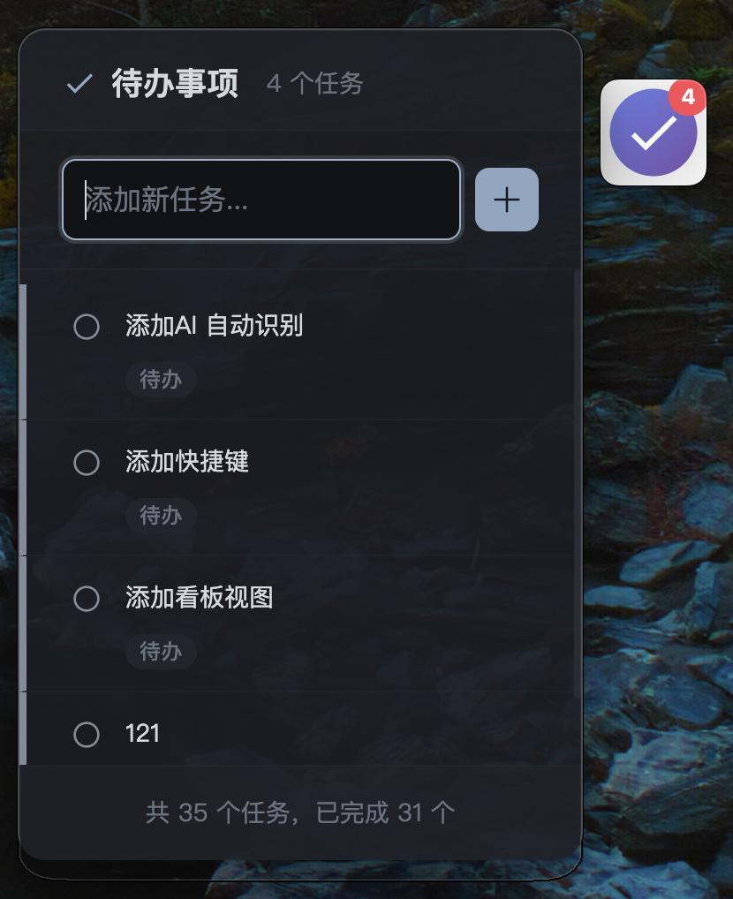

# MoliTodo

<div align="center">
  
  
  **一款常驻在桌面边缘的悬浮式待办事项应用**
  
  [](package.json)
  [](LICENSE)
  [](#支持平台)
</div>

## 简介

MoliTodo 旨在提供最快速的任务查看和添加体验。通过可自定义位置的悬浮图标，将核心信息与操作入口始终置于用户视线可及之处。用户无需切换应用，即可快速管理每日任务，并通过醒目的提醒动画，确保重要事项不会被遗漏。

### 核心特性

- 🎯 **无缝集成** - 不打断当前工作流，与桌面环境融为一体
- ⚡ **即时提醒** - 通过角标和动画提供直观、强烈的任务提醒
- 🚀 **快速操作** - 悬浮即可查看，输入即是添加，操作路径极短
- 💾 **本地存储** - 所有数据存储在本地，保护隐私安全
- 🎨 **自定义外观** - 支持透明度、大小调节和主题切换

## 功能特性

### 悬浮图标
- ✅ 始终置顶显示，可拖拽移动
- ✅ 实时显示未完成任务数量角标
- ✅ 任务提醒时自动变色和动画提示
- ✅ 支持透明度和大小自定义

### 任务管理
- ✅ 鼠标悬停即可查看任务列表
- ✅ 快速添加新任务（支持回车键）
- ✅ 一键完成或删除任务
- ✅ 任务状态切换（待办 → 进行中 → 已完成）
- ✅ 设置任务提醒时间
- ✅ 完整的任务管理页面，支持分类查看和搜索

### 智能提醒
- ✅ 自定义提醒时间
- ✅ 系统桌面通知
- ✅ 多种提醒声音选择
- ✅ 逾期任务特殊标识

### 数据管理
- ✅ 本地 SQLite 数据库存储
- ✅ 支持数据导入导出
- ✅ 自动数据备份和恢复
- ✅ 开机自启动设置

## 界面预览

### 悬浮图标和任务面板
<div align="center">
  
</div>

### 任务管理页面
<div align="center">
  
</div>

### 设置页面
<div align="center">
  
</div>

## 快速开始

### 系统要求

- **macOS**: 10.15 (Catalina) 或更高版本
- **Windows**: Windows 10 或更高版本

### 安装方式

#### 方式一：下载预编译版本（推荐）

1. 访问 [Releases 页面](https://github.com/your-username/moli-todo/releases)
2. 下载适合您系统的安装包：
   - **macOS Intel**: `MoliTodo-{version}-x64.dmg`
   - **macOS Apple Silicon**: `MoliTodo-{version}-arm64.dmg`
   - **Windows**: `MoliTodo Setup {version}.exe`
3. 双击安装包完成安装


> 临时解除 Gatekeeper 限制
> ​右键绕过校验​
> 按住 Control 键点击应用图标 → 选择「打开」→ 在弹出的提示中点击「打开」即可强制运行。

>​终端命令解除限制​
> 打开「终端」（应用程序 → 实用工具），输入以下命令后回车：
```
sudo xattr -rd com.apple.quarantine /Applications/MoliTodo.app
```
> 输入密码后即可运行。

#### 方式二：从源码构建

```bash
# 克隆仓库
git clone https://github.com/your-username/moli-todo.git
cd moli-todo

# 安装依赖
npm install

# 运行开发版本
npm run dev

# 构建生产版本
npm run build
```

### 首次使用

1. 启动应用后，您会在屏幕上看到一个悬浮图标
2. 将鼠标悬停在图标上即可查看任务面板
3. 在输入框中输入任务内容，按回车键添加任务
4. 点击系统托盘图标可以访问设置和任务管理页面

## 使用指南

### 基本操作

| 操作 | 方法 |
|------|------|
| 查看任务 | 鼠标悬停在悬浮图标上 |
| 添加任务 | 在任务面板输入框中输入内容并按回车 |
| 完成任务 | 点击任务前的圆圈图标 |
| 删除任务 | 点击任务右侧的删除按钮 |
| 设置提醒 | 点击任务右侧的时钟图标 |
| 移动图标 | 拖拽悬浮图标到任意位置 |

### 任务状态

- **待办** (○) - 新创建的任务
- **进行中** (●) - 正在处理的任务
- **已完成** (✓) - 已完成的任务

点击任务状态图标可以在这三种状态间循环切换。

### 任务管理页面

通过系统托盘菜单或快捷键打开任务管理页面，支持：

- **分类查看**: 今天、计划中、所有任务、已完成
- **搜索功能**: 实时搜索任务内容
- **批量操作**: 选择多个任务进行批量完成或删除
- **详细编辑**: 双击任务进入编辑模式
- **统计信息**: 查看任务完成情况统计

### 设置选项

#### 通用设置
- 开机自启动
- 数据导入导出
- 清除所有数据

#### 外观设置
- 悬浮图标透明度 (20% - 100%)
- 悬浮图标大小 (40px - 80px)
- 主题模式（跟随系统/亮色/暗色）

#### 通知设置
- 提醒声音选择
- 系统通知开关

## 技术架构

MoliTodo 采用现代化的技术栈和架构设计：

### 技术栈
- **框架**: Electron 28.x
- **架构**: 领域驱动设计 (DDD) 分层架构
- **数据库**: SQLite 本地数据库
- **UI**: 原生 HTML/CSS/JavaScript
- **调度**: node-schedule 任务调度

### 项目结构
```
src/
├── main/                    # 主进程 - Electron 主进程管理
├── domain/                  # 领域层 - 核心业务逻辑
├── infrastructure/          # 基础设施层 - 技术实现
├── application/            # 应用层 - 用例协调
└── presentation/           # 表现层 - 用户界面
```

详细的架构说明请参考 [ARCHITECTURE.md](ARCHITECTURE.md)。

## 开发指南

### 开发环境设置

```bash
# 安装依赖
npm install

# 启动开发模式
npm run dev

# 运行测试
npm test

# 构建应用
npm run build
```

### 构建和发布

项目配置了 GitHub Actions 自动构建工作流：

```bash
# 发布新版本
npm version patch  # 或 minor/major
git push origin main --tags
```

详细的构建指南请参考 [BUILD_GUIDE.md](BUILD_GUIDE.md)。

### 贡献指南

我们欢迎社区贡献！请参考以下步骤：

1. Fork 本仓库
2. 创建特性分支 (`git checkout -b feature/AmazingFeature`)
3. 提交更改 (`git commit -m 'Add some AmazingFeature'`)
4. 推送到分支 (`git push origin feature/AmazingFeature`)
5. 创建 Pull Request

## 问题反馈

### 常见问题

#### Q: 应用无法启动怎么办？
A: 请检查系统版本是否符合要求，并尝试以管理员权限运行。

#### Q: 悬浮图标消失了怎么办？
A: 点击系统托盘中的 MoliTodo 图标，选择"显示悬浮图标"。

#### Q: 如何备份我的任务数据？
A: 在设置页面的"通用"标签中，点击"导出数据"按钮。

#### Q: 任务提醒不工作怎么办？
A: 请检查系统通知权限是否已授予 MoliTodo。

### 报告问题

如果您遇到问题或有功能建议，请：

1. 查看 [Issues 页面](https://github.com/your-username/moli-todo/issues) 是否已有相关问题
2. 如果没有，请创建新的 Issue，并提供：
   - 操作系统版本
   - 应用版本
   - 详细的问题描述
   - 重现步骤
   - 错误截图（如有）

## 更新日志

### v0.4.2 (2024-01-XX)
- 🐛 修复事件监听器重复绑定导致的性能问题
- 🐛 修复任务面板中删除操作的指数级调用问题
- ✨ 改进任务管理页面的用户体验
- 🔧 优化数据同步机制

### v0.4.1 (2024-01-XX)
- ✨ 新增任务状态切换功能（待办/进行中/已完成）
- ✨ 新增完整的任务管理页面
- 🐛 修复 SQLite 数据库集成问题
- 🔧 改进应用退出机制

### v0.4.0 (2024-01-XX)
- ✨ 迁移到 SQLite 数据库
- ✨ 新增数据导入导出功能
- ✨ 新增任务搜索和分类功能
- 🎨 改进用户界面设计

查看完整的更新日志请访问 [CHANGELOG.md](CHANGELOG.md)。

## 路线图

### 近期计划 (v0.5.x)
- [ ] 全局快捷键支持
- [ ] 任务标签和分组功能
- [ ] 更多主题选项
- [ ] 性能优化

### 中期计划 (v1.0.x)
- [ ] 插件系统
- [ ] 云同步支持（可选）
- [ ] 移动端应用
- [ ] 团队协作功能

### 长期计划 (v2.0.x)
- [ ] AI 智能助手
- [ ] Web 版本
- [ ] 企业版功能
- [ ] 开放 API

## 许可证

本项目采用 MIT 许可证 - 查看 [LICENSE](LICENSE) 文件了解详情。

## 致谢

感谢所有为 MoliTodo 做出贡献的开发者和用户！

特别感谢：
- [Electron](https://electronjs.org/) - 跨平台桌面应用框架
- [SQLite](https://sqlite.org/) - 轻量级数据库引擎
- [node-schedule](https://github.com/node-schedule/node-schedule) - 任务调度库

---

<div align="center">
  Made with ❤️ by MoliTodo Team
  
  [官网](https://molitodo.com) • [文档](https://docs.molitodo.com) • [反馈](https://github.com/your-username/moli-todo/issues)
</div>